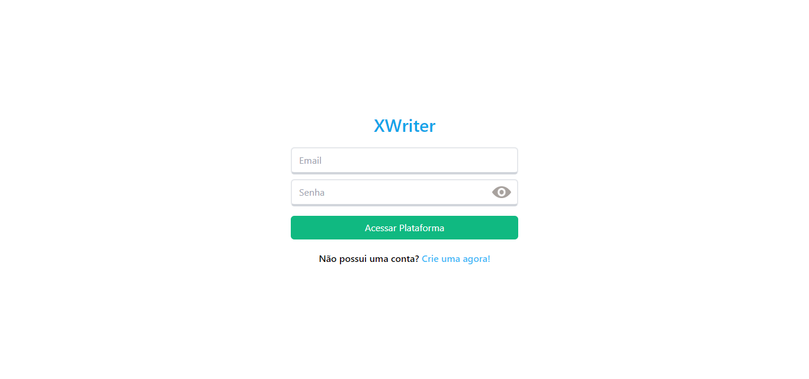

# [XWriter](https://xwriter.vercel.app/)
[](https://xwriter.vercel.app/)

## Sobre ✏️
  ### Essa aplicação web tem o objetivo de logar usuários de uma base dados, através de um formulário de criar conta se necessário, e permitir à eles, postar mensagens. O projeto foi desenvolvido em React com a ajuda de bibliotecas como tailwind css, e foi utilizado um serviço back-end gratuito para armazenar os dados, o Firebase.

## Estado do projeto 🚧
    Completo ✔️ => Usuários podem se cadastrar no app e postar mensagens.
    Responsivo 📲 => Telas principais adaptáveis para diversos dispositivos.

## Tecnologias 💻
  <div>
    <abbr title="React">
      
    </abbr>
    <abbr title="Typescript">
      
    </abbr>
  </div>

## Bibliotecas
  <div>
    <abbr title="Tailwind CSS">
      
    </abbr>
    <abbr title="React Router DOM">
      
    </abbr>
    <abbr title="React Hook Form">
      
    </abbr>
  </div>

## Serviço Back-End
  <div>
    <abbr title="Firebase">
      
    </abbr>
  </div>

## Rodando Localmente (Prompt)
### Clone o projeto
```bash
  git clone https://github.com/Paulo-Mikhael/XWriter
```
### Entre no diretório do projeto
```bash
  cd xwriter
```
### Instale as dependências
```bash
  npm install
```
### Criar um projeto Firebase com as funções 'Authentication' e 'Realtime Database', e conectar à aplicação rodando o comando abaixo e seguindo as instruções dadas [(Documentação de Auxílio)](https://firebase.google.com/docs/cli?hl=pt-br#initialize_a_firebase_project)
```bash
  firebase init
```
### Colocar as configs do seu projeto Firebase nesta variável de ambiente no arquivo .env na raíz do projeto
```bash
  VITE_FIREBASE_CONFIG='{
  "apiKey": "Sua API key",
  "authDomain": "Dominío do projeto",
  "projectId": "ID do projeto",
  //... outras configurações
  "databaseURL": "URL do Realtime Database do projeto"
}'
```
### Inicie o servidor
```bash
  npm run dev
```
## Talvez você queira ver 💡
  ### [Portifólio](https://paulo-mikhael.github.io/Portifolio)
  ### [Currículo (png, jpg ou pdf)](https://drive.google.com/drive/folders/1ER7n3GHZmokEsQJkf6yFAG3E0dC1oLfq?usp=drive_link)

## Confira meus outros projetos 🛠️
  - [Landing Page para um e-commerce de eletrônicos](https://github.com/Paulo-Mikhael/phlox?tab=readme-ov-file#readme)
  - [Landing Page para um e-commerce de plantas](https://github.com/Paulo-Mikhael/casa-verde?tab=readme-ov-file#readme)
  - [Landing Page para uma academia](https://github.com/Paulo-Mikhael/academia-landing-page?tab=readme-ov-file#readme)
  - [Fastask - Gerenciador de Tarefas](https://github.com/Paulo-Mikhael/fastask?tab=readme-ov-file#readme)
  - [[Clone] Pagina da Unity](https://github.com/Paulo-Mikhael/pagina-unity-2024?tab=readme-ov-file#readme)

## Contatos
  [](https://paulo-mikhael.github.io/Portifolio/Pages/contacts/)
  [](https://www.linkedin.com/in/paulo-miguel-4b706022b/)
  [](https://www.instagram.com/pa__miguel?igsh=MWxoYzdqNGluZWcyaA%3D%3D)
  [](https://api.whatsapp.com/send/?phone=5592992813253&text=Ol%C3%A1%21+Gostaria+de+fazer+uma+oferta...&type=phone_number&app_absent=0)
